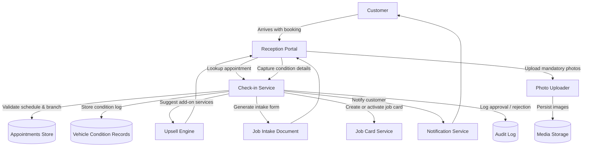

# Appointment Check-in – Data Flow

The diagram shows how staff confirm arrivals, capture vehicle evidence, trigger upsell logic, produce intake documents, and notify customers while logging every decision.
