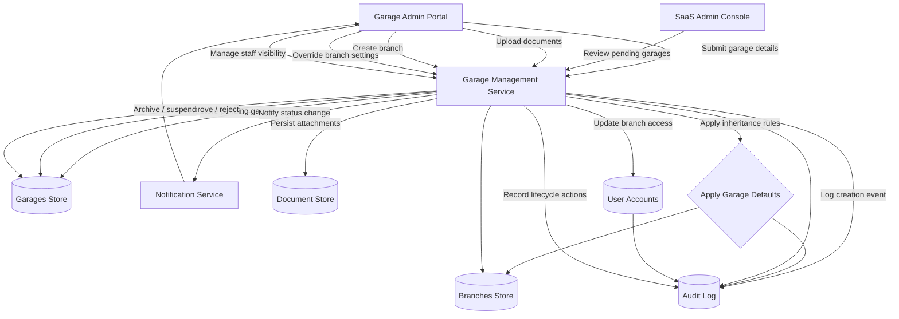

# Garage & Branch Management – Data Flow

The diagram highlights how garage owners submit data, how SaaS administrators approve and activate garages, and how branch inheritance and audit trails are coordinated through the service layer.
