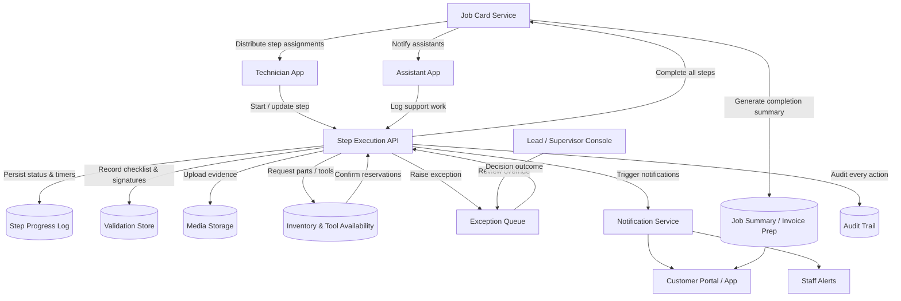

# Job Card Execution & Progress Tracking – Data Flow

This diagram emphasizes the interactions among technicians, assistants, supervisors, inventory, and notification systems as a job card progresses from step execution to completion.
