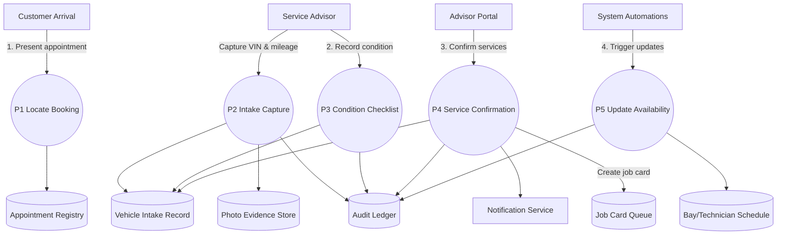

# Appointment Check-in – Level 1 Data Flow

This Level 1 diagram details the check-in journey from appointment retrieval and intake capture through service confirmation, job card creation, and scheduling updates.
