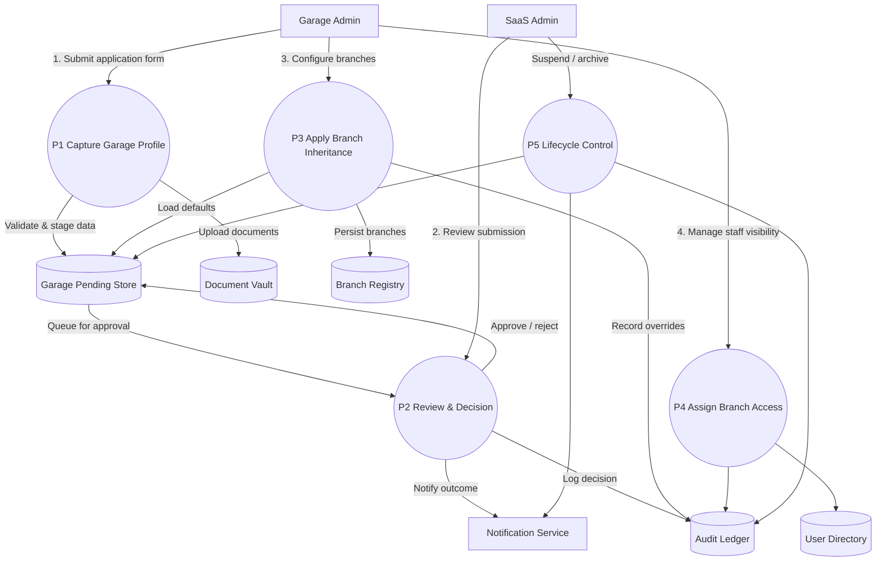

# Garage & Branch Management – Level 1 Data Flow

This Level 1 diagram expands the garage onboarding flow into discrete processes covering profile capture, approval, branch inheritance, staff visibility, and lifecycle enforcement.
