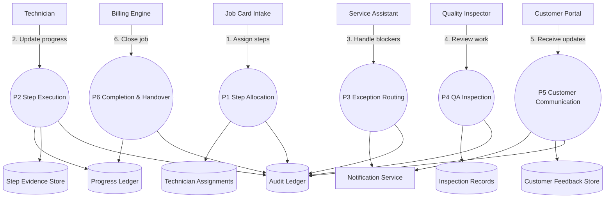

# Job Card Execution & Progress Tracking – Level 1 Data Flow

The Level 1 diagram shows the job card lifecycle from step allocation and technician execution through exception routing, quality checks, customer communications, and final closure.
