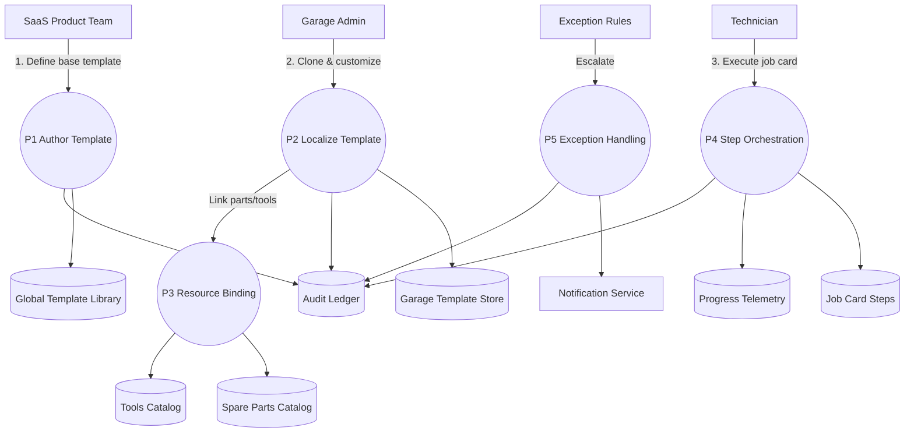

# Service Template & Step Configuration – Level 1 Data Flow

The Level 1 diagram breaks the template lifecycle into authoring, localization, resource binding, job card execution, and exception escalation processes, each interacting with dedicated data stores.
