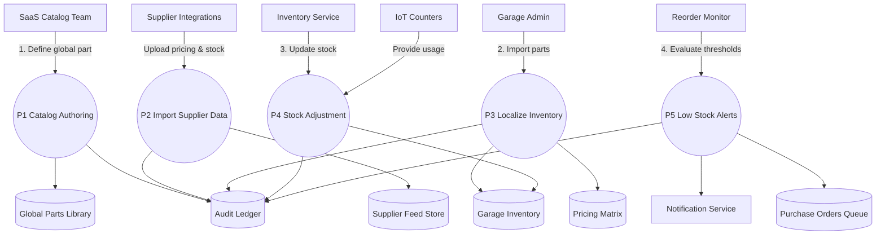

# Spare Parts Management – Level 1 Data Flow

This Level 1 diagram illustrates how parts move from global catalogs and supplier feeds into localized garage inventories, with downstream stock adjustments and automated alerting for replenishment.
