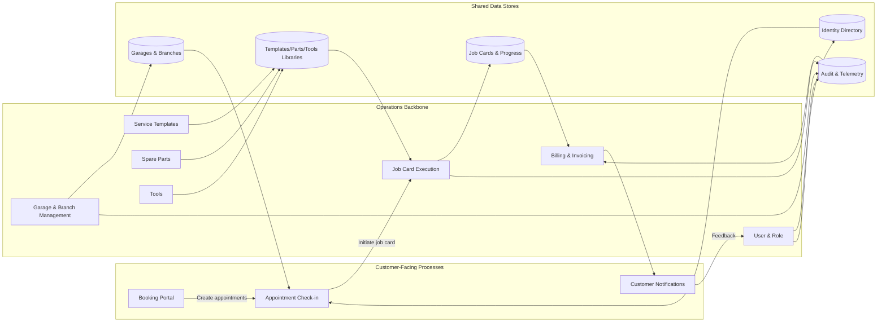

# System Data Flow – Level 1 Decomposition

The Level 1 system diagram clusters customer journeys, operational modules, and shared data stores to highlight how state flows through the SaaS platform end-to-end.
