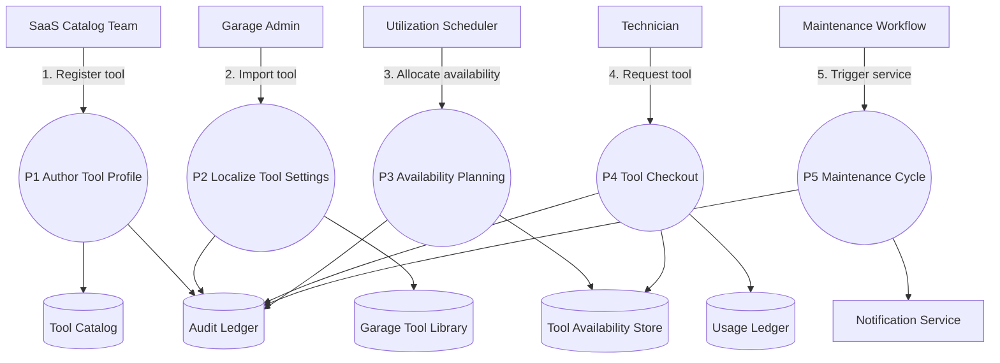

# Tools Management – Level 1 Data Flow

The Level 1 diagram surfaces the dedicated processes for tool catalog authoring, garage import, availability planning, technician checkout, and maintenance scheduling.
