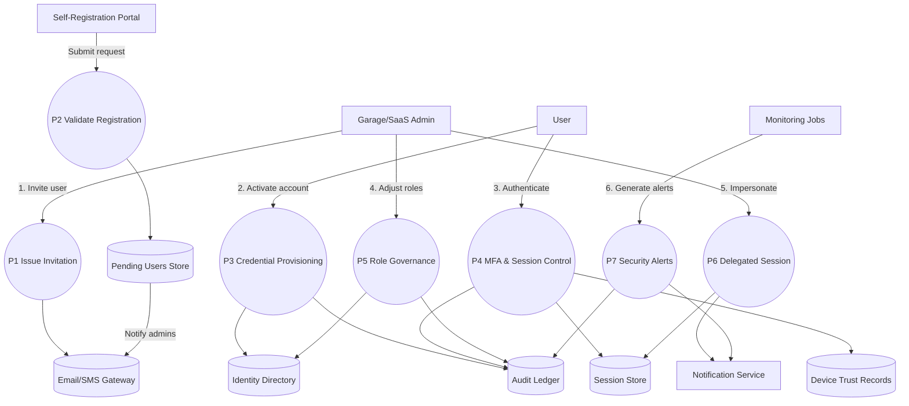

# User & Role Management – Level 1 Data Flow

The Level 1 view enumerates core identity processes: invitation, self-registration validation, credential issuance, MFA enforcement, role governance, impersonation, and alerting.
