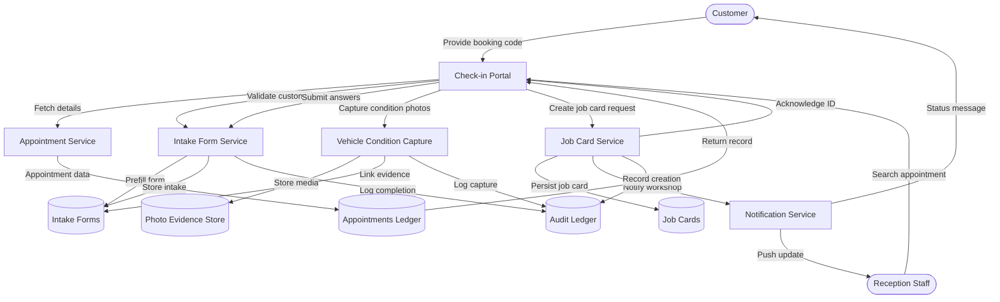

# Appointment Check-in – Level 2 (Intake and Handover)

This Level 2 diagram shows how the intake portal orchestrates appointment retrieval, digital forms, vehicle condition capture, and job card creation while persisting evidence and audit history.
