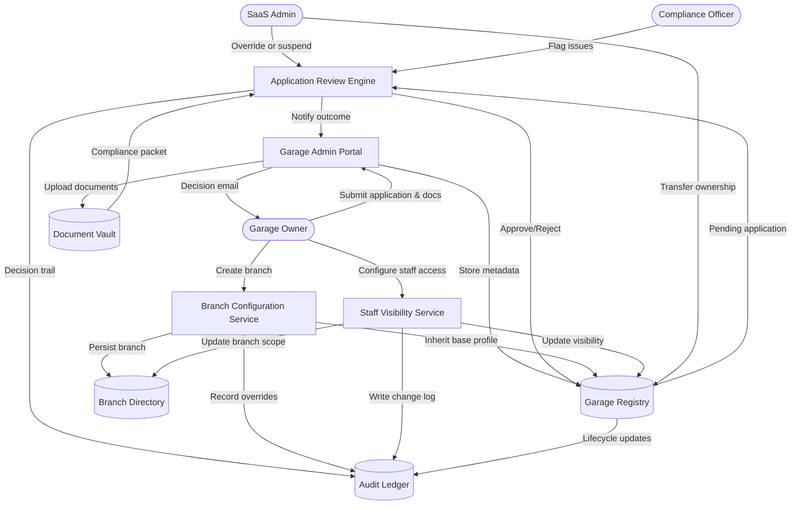

# Garage & Branch Management – Level 2 (Onboarding and Governance)

The Level 2 view surfaces how onboarding, compliance, branch configuration, and staff visibility actions converge on shared data stores and audit records.
