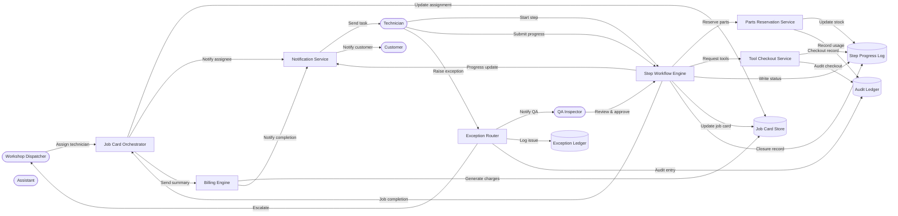

# Job Card Execution – Level 2 (Workshop Progress)

The Level 2 job card diagram captures technician execution, resource consumption, exception handling, and quality assurance interactions leading to billing and customer notifications.
