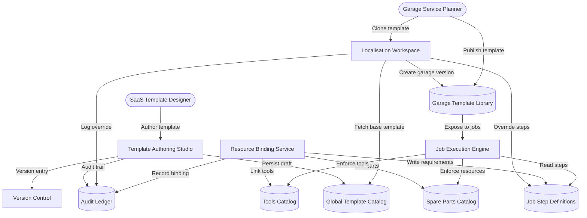

# Service Template & Step Configuration – Level 2 (Template Localisation)

This Level 2 view clarifies how global templates are authored, localised for individual garages, and bound to the parts, tools, and step definitions consumed by the job execution engine.
