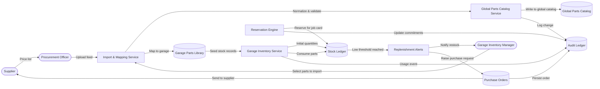

# Spare Parts Management – Level 2 (Supply to Consumption)

The Level 2 spare parts diagram emphasises how supplier feeds become catalogue entries, how garages localise those parts, and how stock consumption triggers automated replenishment workflows.
