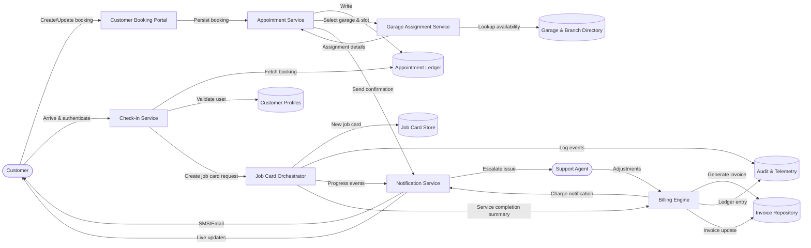

# System Data Flow – Level 2 (Customer Journey to Billing)

This Level 2 diagram follows a single customer journey from booking through billing, exposing the interactions among shared data stores and operational services that maintain state consistency.
