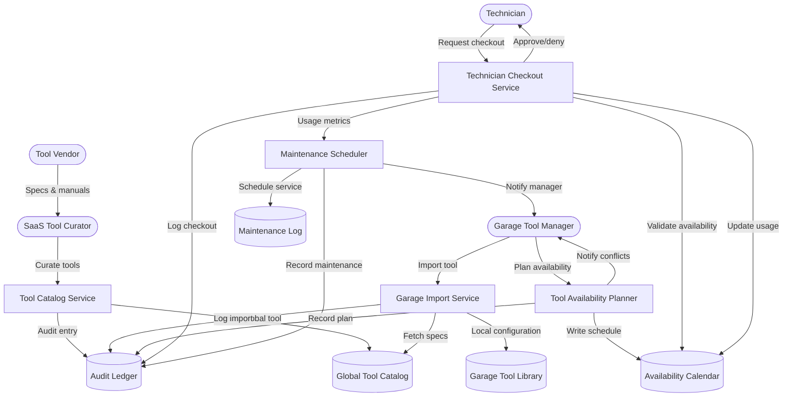

# Tools Management – Level 2 (Availability & Maintenance)

The Level 2 tools diagram exposes how curated tool data flows into garage-specific catalogues, how availability is coordinated, and how technician usage feeds maintenance scheduling and audit trails.
