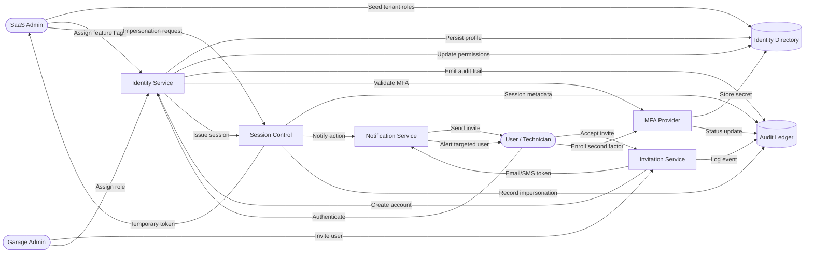

# User & Role Management – Level 2 (Identity Lifecycle)

The Level 2 diagram highlights how invitations, MFA enrollment, role assignments, and impersonation events rely on the identity directory, MFA provider, and shared audit store.
