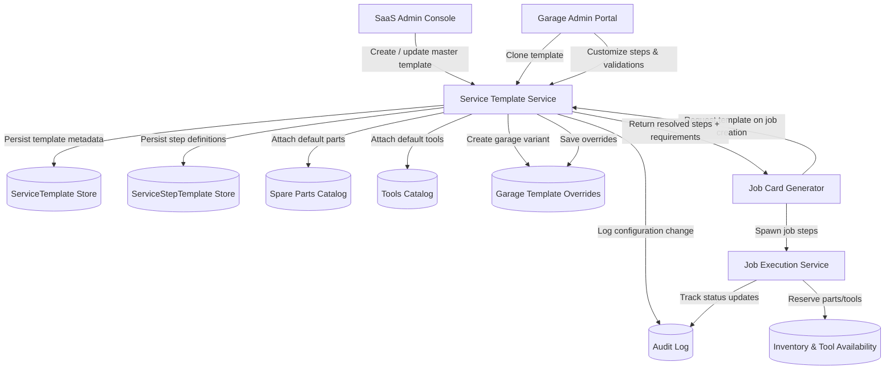

# Service Template & Step Configuration – Data Flow

The diagram shows how SaaS administrators manage global templates, how garages clone and customize them, and how the resolved configuration feeds job card generation and execution.
