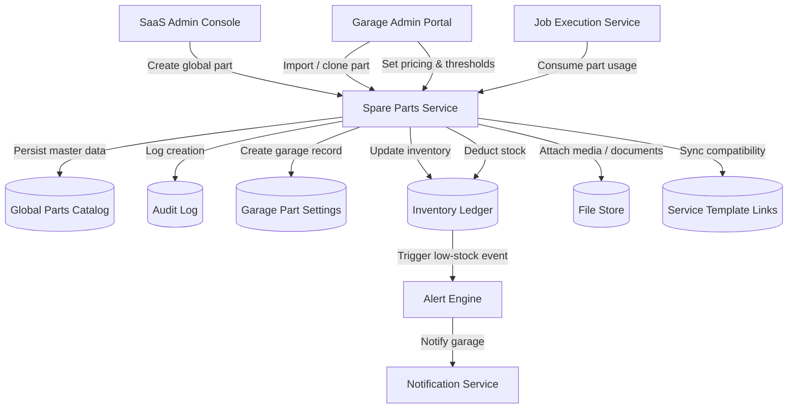

# Spare Parts Management – Data Flow

This diagram captures how global parts are authored, localized per garage, synchronized with service templates, and how ongoing job execution updates inventory and alerts.
