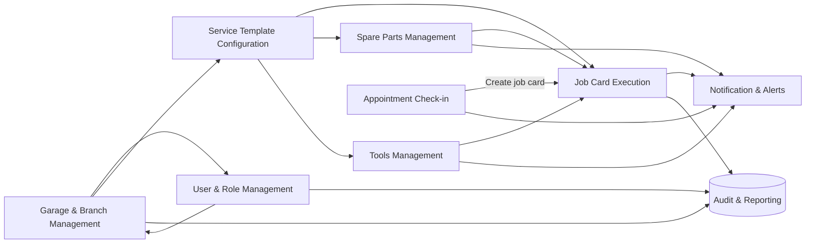

# System Data Flow Overview

The overview diagram summarizes how onboarding garages and staff enables template configuration, how service templates draw on parts and tools catalogs, and how appointment check-ins initiate job cards whose execution feeds notifications and audit reporting.
