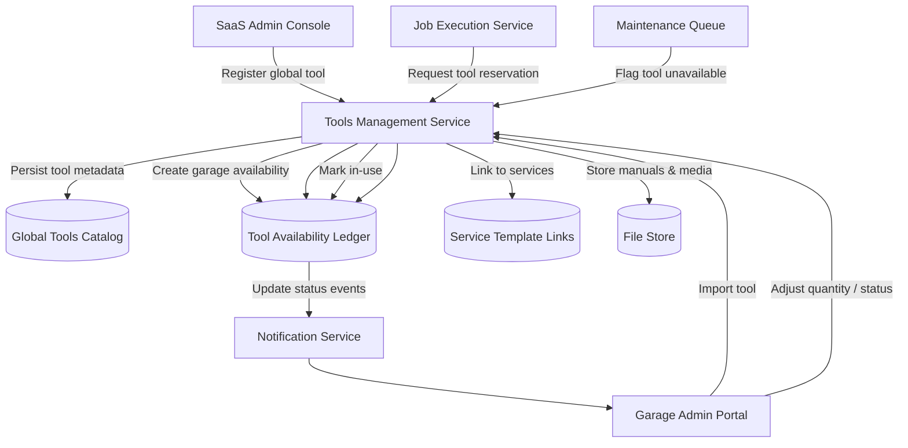

# Tools Management – Data Flow

```mermaid
flowchart TD
    SA[SaaS Admin Console] -->|Register global tool| TMS[Tools Management Service]
    TMS -->|Persist tool metadata| Tools[(Global Tools Catalog)]
    GA[Garage Admin Portal] -->|Import tool| TMS
    TMS -->|Create garage availability| Availability[(Tool Availability Ledger)]
    GA -->|Adjust quantity / status| TMS
    TMS --> Availability
    TMS -->|Link to services| Templates[(Service Template Links)]
    JobExec[Job Execution Service] -->|Request tool reservation| TMS
    TMS -->|Mark in-use| Availability
    Availability -->|Update status events| Notify[Notification Service]
    Notify --> GA
    TMS -->|Store manuals & media| Storage[(File Store)]
    Maintenance[Maintenance Queue] -->|Flag tool unavailable| TMS
    TMS --> Availability
```

The flow highlights how tools are cataloged, localized for branches, reserved during job execution, and surfaced through notifications when status changes occur.
