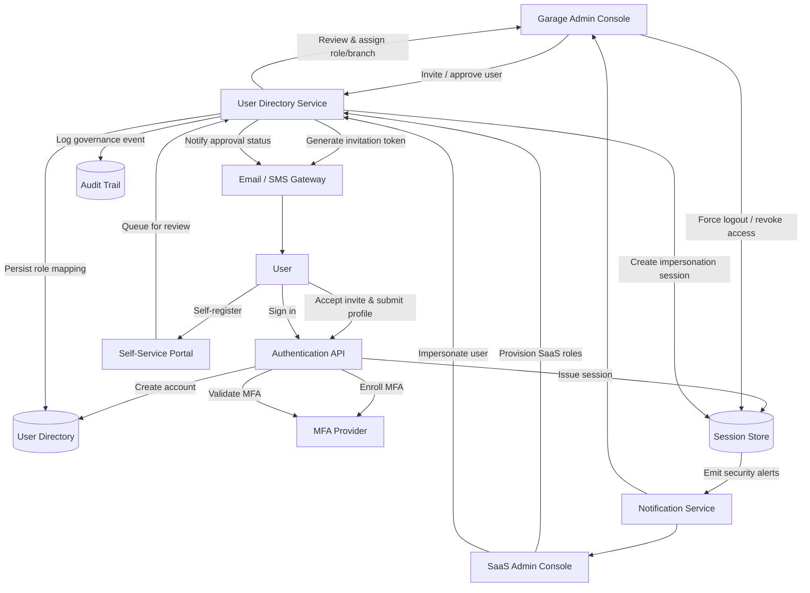

# User & Role Management – Data Flow

The flow illustrates invitation and self-registration paths, approval and role assignment activities, MFA enrolment, and how sessions and audit logs are coordinated for governance.
